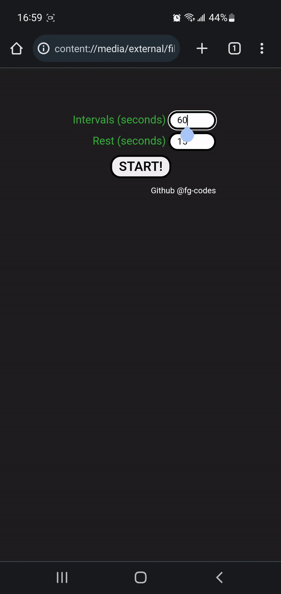
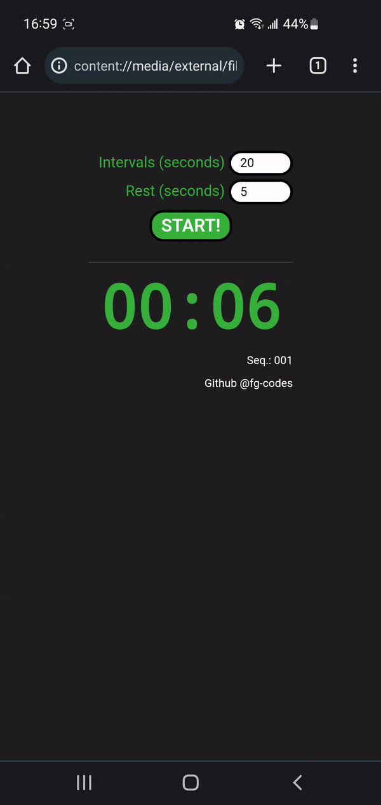

# Chrono - My first project

## About
_2022-12-10_ - This project was firstly made to be used with low/unstable internet connection. My main objective was to create a countdown chrono that I can use when doing yoga & stretching sessions with no internet (off mobile data or airplane mode). I succeeded in making it work on my Android local files but then decided to update it and share it as a first project. The next goal is to build a cross-platform app with this project.

---
## Features
The default settings start a 60-second countdown. This tends to be the ideal time frame for getting the most from a body stretch. The 15-second pause lets the user rest and change their position. After every interval, a bell sound rings alerting the user to start a new stretch or to rest. 

---
## Screenshots

---
## Updates
_2023-01-31_ - Modified README.md (added more details and demo gifs). Fixed two minor flaws in HTML elements (path to other files).
